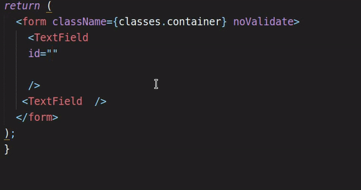
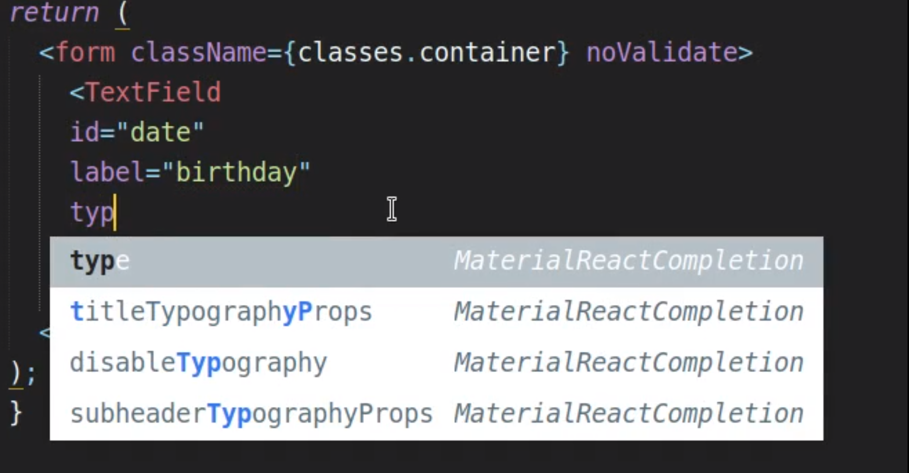

materialui-component-autocomplete [](https://github.com/Pushpamk/materialui-component-sublime-autocomplete/releases/tag/0.1.0)
=============

### MaterialUi Component Sublime Plugin

Auto-complete plugin for MaterialUi Component props .

### MaterialUi

MaterialUi is a React components for faster and easier web development. Build your own design system, or start with Material Design.

* Homepage: [https://material-ui.com/](https://material-ui.com/)

### Installation


You can clone this repository to the Packages directory of your Sublime installation.

```bash
git clone https://github.com/Pushpamk/materialui-component-sublime-autocomplete.git
```

OR 


Download and paste in Installed Packages from [release](https://material-ui.com/) 

### Usage

**Props name autocompletion**: When inside double quotes of a class attribute (`class="[HERE]"`), suggestions will appear for all `uk-` classes.




**Component attributes autocompletion**: When inside a tag, but outside of a quoted attribute string (`<div [HERE] >`), suggestions will appear for all props.

**Note**: In order for the suggestions to appear, your document needs to have the syntax set to `JS`. You can set the syntax from the menu *View > Syntax* or via the Command Palette.

To make a new version of the plugin available via package control, a new version tag needs to be created.

## Copyright and license

Licensed under the [MIT License](LICENSE)